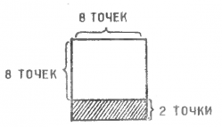
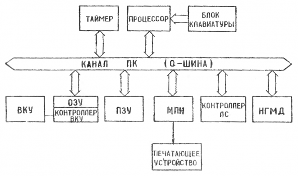
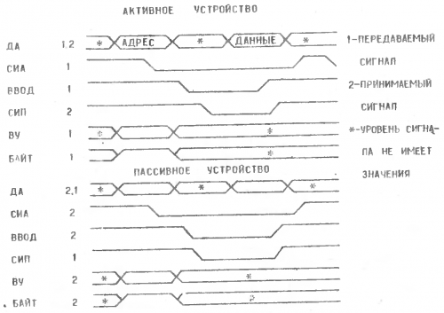
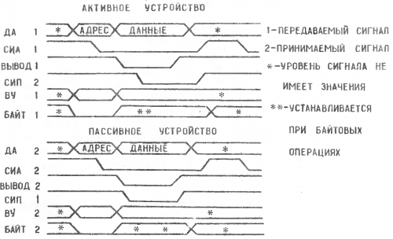
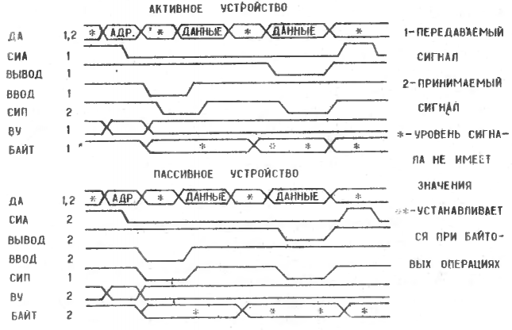

# 5 Устройство и работа ПК

Основным устройством ПК является центральный процессор, который управляет
распределением времени использования канала внешними устройствами и выполняет
все необходимые арифметико-логические операции для обработки информации. Он
содержит 16 быстродействующих регистров общего назначения (РОН), 8 из них
(R0...R7) программно доступны, а 8 других используются как служебные регистры
при выполнении микрокоманд.

Центральный процессор выполняет одноадресные команды, двухадресные команды,
команды расширенной арифметики и может обрабатывать как 16-разрядные слова,
так и 8-разрядные байты. Возможность использования 8 методов адресации
позволяет вести высокоэффективную обработку данных, хранимых в любой ячейке
памяти или в регистре.

## 5.1 Регистры общего назначения

БИС АЛУ содержит 16-разрядные РОН, способные выполнять различные функции. Они
могут служить в качестве накопительных регистров, индексных регистров,
регистров автоинкрементной и автодекрементной адресации и т.д. РОН
используются для выборки операндов и записи результатов при выполнении
арифметико-логических операций аналогично ячейкам памяти и регистрам внешних
устройств.

Два из 8 программно-доступных регистров общего назначения, R6 и R7, имеют,
кроме того, специальное назначение. Регистр R6 используется как указатель
стека (УС) и содержит адрес последней заполненной ячейки стека. Регистр R7
служит счетчиком команд (СК) и содержит адрес следующей выполняемой команды.

Операции по выполнению команд с регистровым методом адресации являются
внутренними по отношению к микропроцессору и не требуют выполнения циклов
обращения к каналу (за исключением цикла выборки команды). Обмен же данными с
памятью и внешними устройствами выполняестся через канал и занимает более
длительное время. Таким образом, использование РОН для хранения операндов при
процессорных операциях повышает быстродействие ПК.

## 5.2 Слово состояния процессора

Слово состояния прцессора (ССП) содержит информацию о текущем состоянии
процессора. Это информация о текущем приоритете процессора, значения кодов
условий ветвления, зависящих от результата выполнения команды, и состояние
Т-разряда, используемого при отладке программы. На рис.2 показан формат ССП.
Разряд приоритета процессора (7-й разряд ССП) может находиться в состоянии
«0» или «1». В последнем случае внешние устройства не могут вызвать
прерывание текущей программы.

Коды условий ветвления содержат информацию о результате последней выполненной
процессором команды. Процедуру установки их в соответстсвующее состояние
выполняют все арифметические и логические одноадресные и двухадресные
команды.

Установка отдельных разрядов этих кодов выполняется в следующих случаях:

* Z=1, если результат равен 0;
* N=1, если результат < 0;
* С=1, если в результате выполнения команды произошел перенос из самого
  старшего разряда, либо если при сдвиге вправо (или влево) из самого
  младшего (или самого старшего) разряда была выдвинута единица;
* V=1, если в результате выполнения команды произошло арифметическое
  переполнение.

Если T=1, то произойдет прерывание программы с вектором 14.

```
  15                           8   7   6   5   4   3   2   1   0
 ┌───┬───┬───┬───┬───┬───┬───┬───┬───┬───┬───┬───┬───┬───┬───┬───┐
 │                                 Р           Т   N   Z   V   C │
 └───┴───┴───┴───┴───┴───┴───┴───┴─┬─┴───┴───┴─┬─┴─┬─┴─┬─┴─┬─┴─┬─┘
                                   │           │   │   │   │   │
  Разряд приоритета процессора ────┘           │   │   │   │   │
                                               │   │   │   │   │
    Прерывание по Т-разряду   ─────────────────┘   │   │   │   │
                                                   │   │   │   │
    Отрицательный результат   ─────────────────────┘   │   │   │
                                                       │   │   │
    Нулевой результат         ─────────────────────────┘   │   │
                                                           │   │
    Арифметическое переполнение ───────────────────────────┘   │
                                                               │
    Перенос старшего байта      ───────────────────────────────┘
```

*Рис.2. Формат слова состояния процессора*

## 5.3 Система команд

В центральном процессоре ПК используются три типа команд: безадресные,
одноадресные и двухадресные. В безадресных командах код команды содержит
только код операции. Формат одноадресных команд имеет следующий вид:

```
       ─┬─────────┬───────────────────────┬─────────┬─
        │   КОП   │        Метод          │   РОН   │
        │         │      адресации        │         │
       ─┴─────────┴───────────────────────┴─────────┴─
         15      6 5                     3 2       0
```

*Формат одноадресных команд*

Формат двухадресных команд имеет следующий вид:
```
        ┌───────┬───────────┬───────┬─────────────┬─────┐
        │  КОП  │   Метод   │  РОН  │    Метод    │ РОН │
        │       │ адресации │       │  адресации  │     │
        └───────┴───────────┴───────┴─────────────┴─────┘
        15    12 11        9 8     6 5           3 2   0

                 ──────────────────  ────────────────────
        Поле адресации операнда      Поле адресации опе-
        источника (SS)               ранда приемника (DD)
```

*Формат двухадресных команд*

Метод адресации кодируется тремя двоичными разрядами:
```
                ─┬──────┬───────┬──────┬─
                 │      │       │      │
                 │      │       │      │
                ─┴──────┴───────┴──────┴─
                    │       │       └─ ─ Признак прямой (0)
                    │       │            или косвенной (1)
                    └─ ─┬─ ─┘            адресации
                        │
                        └─ ─ ─ ─ Адресация:
                              00 — регистровая
                              01 — с автоувеличением
                              10 — с автоуменьшением
                              11 — индексная
```

*Метод адресации*

Таким образом, существует всего 8 способов адресации (4 прямых и 4
косвенных).

Система команд центрального процессора (ЦП) приведена в приложении 1.

## 5.4 Программное обеспечение ПК

Для организации взаимодействия структурных компонентов между собой ПК имеет
резидентное программное обеспечение, которое постоянно находится в ПЗУ модуля
процессора и начинает работать сразу же после включения питания.

Состав резидентного ПО ПК:

1. Программа холодного старта.
2. Программа взаимодействия ПК в локальной сети.
3. Программа пультового терминала.
4. Программа обработки данных с клавиатуры.
5. Программа вывода символов на экран монитора.
6. Программа HALT-монитора.
7. Библиотека графических примитивов.
8. Стандартный знакогенератор.
9. Программа обмена данных с периферийными устройствами.

Программа холодного старта начинает работу при нажатии на кнопку
<kbd>ПУСК</kbd>. Она устанавливает все устройства, входящие в ПК, в начальное
положение и при наличии подключения к каналу ПК платы локальной сети передает
управление программе взаимодействия ПК в локальной сети. Программа
взаимодействия ПК в локальной сети выводит на экран видеомонитора надпись
«ЖДИТЕ...» и настраивает ПК на прием информации из локальной сети. При
отсутствии платы локальной сети, либо при одновременном нажатии на клавиши
<kbd>УПР</kbd> и <kbd>ФСД/СТОП</kbd> (здесь и далее в таких случаях следует
первой нажать клавишу <kbd>УПР</kbd> и, зафиксировав ее, нажать следующую
клавишу) процессор переходит на программу пультового терминала.

Программа пультового терминала непосредственно взаимодействует с программой
обработки данных с клавиатуры, программой вывода символов на экран
видеомонитора и стандартным знакогенератором. При этом на экране
видеомонитора появляется надпись «ПУЛЬТ>». В этом режиме монитор системы
отрабатывает следующие директивы, вводимые с клавиатуры:

* <kbd>УПР</kbd> + <kbd>L</kbd> — очистка экрана;
* <kbd>S</kbd> —- вывод на экран видеомонитора содержимого регистров
  процессора;
* <kbd>D</kbd>, <kbd>1D</kbd> — загрузка операционной системы в ОЗУ с
  дисковода с номером 1 (с первой и со второй стороны, соответственно);
* <kbd>2D</kbd>, <kbd>3D</kbd> — загрузка операционной системы в ОЗУ с
  дисковода с номером 2 (с первой и со второй стороны, соответственно);
* <kbd>/</kbd> — раскрытие содержимого ячеек памяти (<kbd>ПС</kbd> —
  следующий адрес, <kbd>^</kbd> (клавиша <kbd>Ч</kbd>) — предыдущий адрес,
  <kbd>ВВОД</kbd> — выход);
* <kbd>G</kbd> — выполнение программы;
* <kbd>N</kbd> — выход на программу взаимодействия ПК в локальной сети;
* <kbd>УПР</kbd> + <kbd>СТОП</kbd> — останов выполняемой программы.

Программа вывода символов на экран видеомонитора в режиме вывода
алфавитно-цифровой информации формирует 25 строк по 50 символов.

Каждый символ формируется матрицей точек 8×8. Расстояние между строками
формируется программно, путем заполнения нулями участка растра, находящегося
под знакосинтезирующей матрицей (рис.3).



*Рис.3. Матрица формирования изображения алфавитно-цифрового знака на экране
видеомонитора*

Программа графических примитивов формирует изображение точки и линии при
выводе графической информации на экран видеомонитора.


## 5.5 Работа канала персонального компьютера

Персональный компьютер имеет модульный принцип построения, т. е. все
функциональные блоки ПК выполнены в виде конструктивно законченных устройств
(модулей), связь между которыми осуществляется через единый канал обмена
информацией. Канал обмена информацией является простой быстродействующей
системой связей, соединяющей процессор, память и все внешние устройства.

На рис.4 представлена упрощенная блок-схема ПК.



*Рис.4. Блок-схема ПК*

Все модули, подключенные к каналу ПК, используют одни и те же канальные
связи. Связь между двумя устройствами, подключенными к каналу, осуществляется
по принципу «управляющий-управляемый» (активный-пассивный). В любой момент
времени только одно устройство является активным (процессор).

Активное устройство управляет циклами обращения к каналу и удовлетворяет,
если это необходимо, требованиям прерывания от внешних устройств. Пассивное
устройство (управляемое) является только исполнительным. Оно может принимать
или передавать информацию только под управлением активного устройства.

Связь через канал замкнута, т. е. на управляющий сигнал, передаваемый активным
устройством, должен поступить ответный сигнал пассивного устройства.
Асинхронное выполнение операции передачи данных устраняет необходимость в
тактовых импульсах. В результате этого обмен с каждым устройством может
происходить с максимально возможным для данного устройства быстродействием.

### 5.5.1 Сигналы управления каналом

Как адрес, так и данные (слова или байты) передаются по одним и тем же 16
линиям адреса/данных <kbd>К ДА(00-15) Н</kbd>. Любой цикл обращения к каналу
начинается с адресации пассивного устройства. После завершения адресной части
цикла активное устройство выполняет прием или передачу данных, которые
выполняются асинхронно и требуют ответа от адресуемого устройства.

Функции синхронизации при передаче адреса и приеме/передаче данных выполняют
сигналы управления каналом <kbd>К СИА Н</kbd>, <kbd>К БАЙТ Н</kbd>, <kbd>К
ВВОД Н</kbd>, <kbd>К ВЫВОД Н</kbd>, <kbd>К СИП Н</kbd>.

Сигнал синхронизации активного устройства (<kbd>К СИА Н</kbd>) вырабатывается
активным устройством (процессором). Передний фронт этого сигнала означает,
что адрес находится на линиях <kbd>К ДА(00-15) Н</kbd>. Сигнал <kbd>К СИА
Н</kbd> сохраняет активный уровень до окончания текущего цикла обращения к
каналу.

Сигнал синхронизации пассивного устройства (<kbd>К СИП Н</kbd>) информирует
активное устройство о том, что данные приняты с линий <kbd>К ДА(00-15)
Н</kbd> или данные установлены на информационных линиях. Этот сигнал
вырабатывается в ответ на сигнал <kbd>К ВВОД Н</kbd> и <kbd>К ВЫВОД Н</kbd>.

Сигнал <kbd>К ВВОД Н</kbd> используется в двух случаях:

1. При вырабатывании во время действия сигнала <kbd>К СИА Н</kbd> он означает
   ввод данных по отношению к активному устройству. Сигнал
   <kbd>К ВВОД Н</kbd> вырабатывается, когда активное устройство готово
   принять данные от пассивного устройства.

2. При вырабатывании вместе с сигналом <kbd>К ВПР Н</kbd> (сигнал
   <kbd>К СИА Н</kbd> при этом не активен) означает, что выполняется операция
   ввода адреса вектора при прерывании программы.

Сигнал <kbd>К ВЫВОД Н</kbd> означает, что по отношению к активному устройству
выполняется операция вывода, и на линиях <kbd>К ДА(00-15) Н</kbd> помещены
истинные данные. Выработка сигнала <kbd>К ВЫВОД Н</kbd> активным устройством
по отношению к подаваемым в канал данным задержана не менее чем на 150 нс.
Пассивное устройство, отвечая на сигнал <kbd>К ВЫВОД Н</kbd>, должно
вырабатывать ответный сигнал <kbd>К СИП Н</kbd>, чтобы завершить операцию
передачи данных.

Сигнал вывода байта, <kbd>К БАЙТ Н</kbd>, используется в двух случаях:

1. При вырабатывании в адресной части цикла для указания, что далее следует
   операция «Вывод байта»;

2. При передаче данных в цикле ВЫВОД для указания, что выводится байт.

Сигнал запроса прерывания <kbd>К ЗПР Н</kbd> вырабатывается пассивным
устройствром, если его триггеры запроса прерывания и разрешения прерывания
установлены. Этот сигнал информирует процессор о том, то устройство готово
передавать или принимать данные. Если 7 разряд ССП установлен в ноль,
процессор разрешит прерывание, вырабатывая сигналы <kbd>К ВВОД Н</kbd> и
<kbd>К ППРО Н</kbd> (выходной сигнал подтверждения прерывания).

Сигнал выбора (внешнего устройства (<kbd>К ВУ Н</kbd>) вырабатывается
активным устройством, когда в канал передается адрес, относящийся к последним
4К адресов (с 160000 по 177776). Сигнал <kbd>К ВУ Н</kbd> остается активным
на время адресной части цикла обращения к каналу.

Сигнал <kbd>К СБРОС Н</kbd> вырабатывается процессором, чтобы выполнить
начальную установку всех устройств, подключенных к каналу. Сигнал <kbd>К
СБРОС Н</kbd> вырабатывается программно по команде и при пуске программы
(нажатии клавиши <kbd>G</kbd> в режиме пульта).

### 5.5.2 Циклы обращения к каналу

Для выполнения любой команды процессору требуется выполнить хотя бы одну
операцию обращения к каналу. Для некоторых команд требуется выполнить
несколько операций. Первой такой операцией для всех команд является ввод
данных из ячейки памяти, адрес которой определяется счетчиком команд (CK).

Все операции обращения к каналу для ввода и вывода данных называются циклами
обращения к каналу. Если для выполнения команды не требуется обращаться за
операндами к памяти или к внешним устройствам, дополнительных циклов канала
не требуется. Однако, если выполняется команда с обращением к памяти или
устройствам, то в этом случае могут выполняться любые из следующих циклов:

* ввод;
* ввод-пауза-вывод:
* вывод;
* вывод байта.

#### 5.5.2.1 Цикл ВВОД

Направление передачи при выполнении операций обмена данными определяется по
отношению к активному устройству. При выполнении цикла ВВОД данные передаются
от пассивного устройства к активному.

Временная диаграмма выполнения цикла ВВОД представлена на рис.5.



*Рис.5. Временная диаграмма выполнения цикла ВВОД*

Порядок выполнения операций следующий:

1. Активное устройство в адресной части передает по линиям
   <kbd>К ДА(00-I5) H</kbd> адрес, a также вырабатывает сигнал
   <kbd>K BУ H</kbd>, если адрес находится в диапазоне 160000—177777. Hе
   менее чем через 150 нc после установки адреса активное устройство
   вырабатывает сигнал <kbd>К СИА H</kbd>, предназначенный для запоминания
   адреса во входной логике выбранного устройства.

2. Пассивное устройство дешифрирует адрес и запоминает его.

3. Активное устройство снимает адрес с линий <kbd>К ДА(00-15) H</kbd>,
   очищает линию <kbd>К ВУ H</kbd> и вырабатывает сигнал<kbd>K ВВОД H</kbd>,
   сигнализируя о том, что оно готово принять данные от пассивного устройства
   и ожидает поступления сигнала<kbd>К СИП Н</kbd>.

4. Пассивное устройство помещает данные на линии <kbd>К ДА(00-15) Н</kbd> и
   вырабатывает сигнал <kbd>К СИП H</kbd>, сигнализирующий о том, что данные
   находятся в канале. Если сигнал <kbd>К СИП H</kbd> не вырабатывается в
   течение 10 мкс после выработки сигнала <kbd>К ВВОД Н</kbd>, центральный
   процессор переходит к обслуживанию внутреннего прерывания по ошибке
   обращения к каналу с адресом вектора 4.

5. Активное устройство принимает сигнал <kbd>К СИП Н</kbd>, принимает данные,
   снимает сигнал <kbd>К ВВОД Н</kbd>.

6. Пассивное устройство снимает сигнал <kbd>К СИП H</kbd>, завершая операцию
   передачи данных.

7. Активное устройство снимает сигнал <kbd>К СИА Н</kbd> по заднему фронту
   сигнала <kbd>К СИП H</kbd>, завершая тем самым канальный цикл ВВОД.

Во время выполнения цикла ВВОД сигнал <kbd>К БАЙТ H</kbd> не вырабатывается.

#### 5.5.2.2 Цикл ВЫВОД

При выполнении цикла ВЫВОД данные передаются от активного устройства к
пассивному, например, происходит запись данных в память.

Временная диаграмма выполнения цикла ВЫВОД представлена на рис.6.



*Рис.6. Временная диаграмма выполнения цикла ВЫВОД*

Порядок выполнения операций следующий:

1. Активное устройство в адресной части цикла передает по линиям
   <kbd>К ДА(00-15) Н</kbd> адрес, а также сигнал<kbd>К ВУ Н</kbd>, если это
   необходимо.

2. Кроме того, в цикле ВЫВОД в адресной части вырабатывается сигнал
   <kbd>К БАЙТ H</kbd>. He менее чем через 150 нс после установки адреса
   вырабатывается сигнал <kbd>К СИА Н</kbd>. Функции, выполняемые этими двумя
   сигналами, те же, что и в цикле ВВОД.

3. Пассивное устройство дешифрирует адрес и запоминает его. Активное
   устройство снимает адрес с линий <kbd>К ДА(00-15) Н</kbd>, очищает линию
   <kbd>К ВУ H</kbd> и снимает сигнал <kbd>К БАЙТ Н</kbd>. После этого
   активное устройство помещает данные на линии <kbd>К ДА(00-15) Н</kbd> и
   вырабатывает сигнал <kbd>К ВЫВОД Н</kbd>.

4. Пассивное устройство принимает данные с линий <kbd>К ДА(00-15) Н</kbd> и
   вырабатывает сигнал <kbd>К СИП Н</kbd>.

6. Активное устройство снимает сигнал <kbd>К CИА H</kbd>, завершая цикл
   канала ВЫВОД.

7. В цикле ВЫВОД сигнал <kbd>К БАЙТ Н</kbd> в части передачи данных может
   быть как неактивным, так и активным, определяя тем самым вывод
   16-разрядного слова или вывод байта.

#### 5.5.2.3 Цикл ВВОД-ПАУЗА-ВЫВОД

Этот цикл аналогичен операции считывание-модификация-запись. Временная
диаграмма выполнения цикла ВВОД-ПАУЗА-ВЫВОД представлена на рис.7.



*Рис. 7. Временная диаграмма выполнения цикла ВВОД-ПАУЗА-ВЫВОД*

Адресная часть и ввод данных выполняется аналогично циклу ВВОД. Однако
<kbd>К СИА Н</kbd> остается активным и после окончания ввода данных, что
позволяет осуществлять вывод модифицированных данных без повторения адресной
части цикла.

Операция по выводу данных может быть байтовой, поэтому сигнал
<kbd>К БАЙТ Н</kbd> в это время может быть как неактивным, так и активным.

## 5.6 Средства обеспечения программной совместимости ПК с машинами семейства «Электроника-60»

Основная сложность переноса существующего системного и прикладного
программного обеспечения, разработанного для машин семейства
«Электроника-60», заключается в том, что в качестве системного терминала
предполагается использование самостоятельного устройства, подключаемого к
каналам ИРПС или МПИ. Терминал должен выполнять достаточно широкий набор
функций ввода, вывода и редактирования символьной и, возможно, графической
информации. Обычно для решения этих задач используют дополнительную микроЭВМ,
подключаемую как внешнее устройство. Однако в данном ПК использовано решение,
позволяющее на системном процессоре полностью эмулировать некоторые внешние
устройства, в том числе системный терминал.

Основная идея заключается в следующем:

1. В общем объеме оперативной памяти «открываются» ячейки, соответствущие
   адресам регистров внешних устройств, подлежающих эмуляции.

2. При обращении программы к этим ячейкам вырабатывается запрос на
   прерывание, в прикладном программном обеспечении неиспользуемое, и
   фиксируется источник прерывания; сигнал подтверждения прерывания приводит
   к перераспределению карты памяти — появляются системные области, в которых
   расположена программа обработки прерывания и ее рабочие ячейки.

3. По источнику прерываний определяется эмулируемое устройство И/ИЛИ по
   содержимому ячейки-регистра этого устройства — действия, которые
   необходимо выполнить.

4. Эмулируется работа устройства.

5. Если других источников прерывания зафиксировано не было, управление
   возвращается к прерванной программе (при этом карта памяти возвращается к
   исходному виду).

