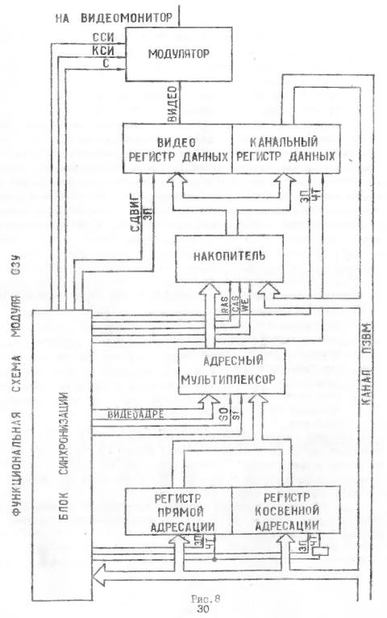
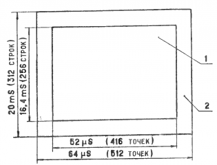
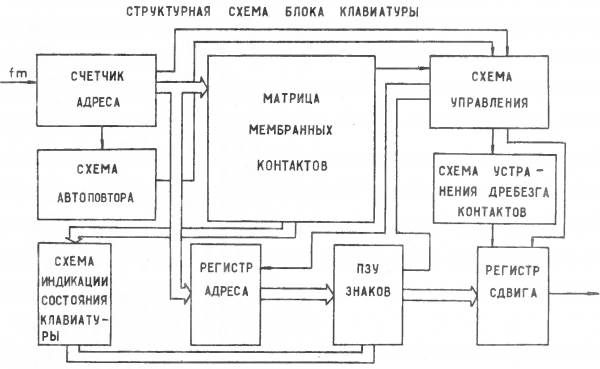

# 6 Устройство и работа составных частей ПК

Конструктивно ПК состоит из следующих функционально законченных узлов и
блоков:

* модуль процессора 6.120.107;
* модуль ОЗУ 6.120.108;
* модуль локальной сети и таймер 6.120.109;
* модуль электронный 2MБ5 2.087.024;
* модуль электронный 2МБ12 2.087.024-01;
* блок клавиатуры 3.059.007;
* видеоконтрольное устройство (ВКУ).

## 6.1 Модуль процессора

Функционально модель процессора 6.120.107 ЭЗ состоит из следующих узлов:

* процессорное ядро;
* системное ПЗУ;
* контроллер клавиатуры;
* аппаратный умножитель;
* HALT-монитор.

### 6.1.1 Процессорное ядро

Процессорное ядро включает в себя центральный процессорный элемент D1
(ЦПЭ КР588ВС2), выполняющий функции арифметико-логического устройства (АЛУ),
пять БИС управляющей памяти D2...D6 (КР588ВУ2), системный контроллер D18
(КР588ВГ1) и два магистральных приемопередатчика (МПП) D21, D24 (КР588ВА1).

АЛУ предназначено для приема, хранения и обработки 16-разрядных чисел.
Преобразование данных выполняется в соответствии с 12-разрядным кодом
микрокоманды.

Последовательность фаз работы микросхемы определяет внутренний блок
синхронизации, функционирование которого начинается с поступлением
отрицательного фронта по входу сигнала сопровождения микрокоманды ВК (вывод
30).

Выполнение любой микрокоманды состоит из комбинации следующих фаз:

* приема — приема и дешифрации микрокоманды, а в некоторых микрокомандах и
  приема операнда по магистрали данных;
* чтения — чтения информации из источника (РОН, АКК, СК, К) в АЛУ и ее
  обработки;
* записи — окончание обработки информации и ее запись в приемник (РОН, АКК,
  СК, К;
* выдачи — выдача результата операции в МД.

Прием микрокоманд и обмен данными по магистрали производится асинхронно и
квитируется сигналами по выводам <kbd>ВК</kbd> и <kbd>Ф1</kbd>, <kbd>В</kbd>
и <kbd>П</kbd>, соответственно. Так как по шине микрокоманд информация может
только приниматься в АЛУ, выводы <kbd>ВК</kbd> и <kbd>Ф1</kbd> —
однонаправленные. Сигналы <kbd>В</kbd> и <kbd>П</kbd> — двунаправленные, т.к.
квитируют передачу данных по МД.

При приеме данных в МД сигнал на входе <kbd>В</kbd> генерируется системным
контроллером D18 и инициирует начало фазы ввода данных, сигнал на выходе
<kbd>П</kbd> служит квитанцией о приеме информации в АЛУ. При выдаче данных в
МД сигнал на выходе <kbd>В</kbd> (генерируется ЦПЭ) инициирует начало фазы
вывода данных, сигнал на входе <kbd>П</kbd> служит квитанцией для ЦПЭ о
приеме информации во внешние схемы. Ограничений на время ответа не
существует.

Управляющая память (УП) представляет собой программируемую логическую матрицу
(ПЛМ) с памятью. Она предназначена для управления работой процессорного ядра
и сочетает в себе функции БИС блока микропрограммного управления и ПЗУ
микрокоманд. Микросхемы с номерами кодировок 0001, 0002, 0004 предназначены
для управления АЛУ, БИС УП с кодировкой 0007 — для управления системным
контроллером D18, БИС с кодировкой 0006 предназначена для аппаратной
реализации команд расширенной арифметики (умножение, деление, сдвиги — MUL,
DIV, ASH, ASHC).

Сигналы на входах <kbd>R0</kbd> и <kbd>R1</kbd> по положительному фронту
устанавливают микросхему УП в исходное состояние. При наличии логического
нуля на выводе <kbd>В</kbd> происходит прием информации с магистрали данных
во входной регистр и по магистрали признаков кодов условий ветвления в
регистр признаков. Приняв информацию, микросхема устанавливает уровень
логического нуля на выводе <kbd>П</kbd> и активный низкий уровень на выводе
<kbd>КК</kbd>. При снятии сигнала «логический ноль» на выводе <kbd>В</kbd>
снимается сигнал и на выводе <kbd>П</kbd>.

По отрицательному фронту сигнала <kbd>Ф1</kbd> прекращается выдача
микрокоманды и происходит «подброс» в высокий потенциал состояния выводов
<kbd>МК(0-12)</kbd>. Если к этому времени сформирована следующая
микрокоманда, то происходит ее запись в регистры с последующей выдачей.

Системный контроллер предназначен для связи внутреннего интерфейса процессора
с внешним стандартным интерфейсом канала типа Q-шины (МПИ, OCT 11305.903-80).

Внутренний интерфейс процессора содержит сигналы, обеспечивающие работу
процессорного ядра. Это сигналы квитирования АЛУ и УП, 16-разрядная
информационная магистраль, четырехразрядная магистраль кода прерывания,
сигналы управления МПП. Сигналы квитирования <kbd>KB1</kbd>, <kbd>KB2</kbd>,
<kbd>КВ3</kbd>, <kbd>КП</kbd> обеспечивают передачу по 16-разрядной
двунаправленной магистрали адресов, данных и векторов прерывания в данный
момент обслуживания.

Внешний интерфейс процессора содержит сигналы, обеспечивающие работу всех
устройств, подключенных к каналу.

Вывод <kbd>КОШ</kbd> служит для подключения RС-цепочки, задающей длительность
сигналов <kbd>ДЧТ</kbd>, <kbd>ДЗП</kbd> до сигнала <kbd>OTB</kbd> и
длительность сигнала <kbd>СБРОС</kbd>.

Вход установки режима начального пуска <kbd>НП</kbd>, путем подачи на него
высокого потенциала, установлен в режим выхода на системное ПЗУ через
адрес-вектор 24.

Выходы <kbd>C1</kbd>, <kbd>C2</kbd> управляют направлением передачи данных
через магистральные приемопередатчики.

Системный контроллер D18 через входы <kbd>Р</kbd>, <kbd>Т</kbd> принимает
информацию о седьмом и четвертом разряде регистра слова состояния процессора
для обработки прерываний.

При нажатии на кнопку <kbd>ПУСК</kbd> на передней панели на выводах 8, 12
микросхемы D40 формируются сигналы начального пуска, которые устанавливают
микросхемы управляющей памяти и системного контроллера в начальное положение
и запускают микропрограмму начального пуска. Данная микропрограмма формирует
обращение процессорного ядра к ячейкам памяти с адресами 160006 и 160010,
откуда читает программный счетчик и слово состояния процессора
соответственно.

### 6.1.2 Системное ПЗУ

В адресном пространстве процессора адреса с 160000 по 167777 занимает
системное ПЗУ. Адресное пространство процессора 140000...157777
зарезервировано под дополнительные 4К слов системного ПЗУ.

При обращении к области памяти обязательного системного ПЗУ контроллер
запоминающего устройства D15 (КР588ВГ2) вырабатывает сигнал <kbd>ВК0</kbd>,
который разрешает выборку данных из ПЗУ D9, D10 (КР573РФ5). Адрес, по
которому ведется обращение, фиксируется в регистрах D7, D8 (КР588ИР1). Сигнал
<kbd>ОТВ</kbd> формирует микросхема D15 с задержкой относительно сигнала
<kbd>ОБМ</kbd>, определяемой времязадающей цепочкой R4, C4.

После установки счетчика команд и ССП процессор выходит на программу
«холодного» старта, записанной в системном ПЗУ.

После программы «холодного» старта процессор выходит на программу обработки
данных с клавиатуры.

### 6.1.3 Контроллер клавиатуры

Контроллер клавиатуры собран на микросхемах D26, D27 (КР588ИР1). Данные с
клавиатуры в последовательном коде через элемент D30.1 (К561ЛН2) поступают на
нулевой разряд канала <kbd>К0</kbd> D26. На вход <kbd>ЗП</kbd> D26 поступают
тактовые импульсы с частотой в два раза меньшей частоты импульсов, на основе
которых формируется информационная последовательность в блоке клавиатуры.
Выходы канала <kbd>K1</kbd> D26 соединены со входами канала <kbd>К0</kbd> D26
со смещением на один разряд, т.е. последовательный код с клавиатуры
преобразуется в параллельный.

По достижении стартовой посылки последнего разряда <kbd>K1</kbd> D26 триггер
D37.2 (К561ТМ2) формирует сигнал готовности контроллера клавиатуры к выдаче
данных. Этот сигнал поступает в HALT-монитор. Инверсным сигналом с триггера
D37.2 код символа переписывается в регистр D27. По окончании записи
вырабатывается сигнал <kbd>ЗЗП</kbd>, который сбрасывает входной регистр D26.

После обработки сигнала <kbd>Н2</kbd> (обращение к регистру данных
клавиатуры, сформированного в модуле ОЗУ), HALT-монитор выдает сигнал чтения
содержимого регистра D27 и код символа вводится в процессор.

### 6.1.4 Аппаратный умножитель

Команды умножения (деления) выполняются БИС умножителя D17 (К588ВР2)
совместно с БИС селектора каналов D19 (КР588ВТ1) и БИС УП D4 (КР588ВУ2-0006).

После поступления команды умножения (деления) на шину ДА БИС УП (0006)
микросхема вырабатывает микрокоманды, под действием которых происходит
обработка двух операндов. Умножение начинается с засылки двух операндов в
регистры умножителя. При операциях чтения, записи данных умножитель формирует
сигнал <kbd>ГОТ</kbd>, отмечающий окончание операции. Чтение результата
производится с младших разрядов произведения. Последним читается регистр
состояния. Время умножения < 2 мкс отсчитывается с загрузки второго операнда
до чтения первого слова результата. При этом используются адреса 170000,
170002, 170004, которые дешифрируются селектором каналов D19.

### 6.1.5 HALT-монитор

HALT-монитор является процедурой, предназначенной для управления процессами,
«невидимыми» для основного программного обеспечения. К ним относятся:
эмуляция системной консоли (клавиатуры), операции пультового терминала,
работа с расширенной памятью.

Запросы на использование ресурсов HALT-монитора формируются двумя способами:
команда HALT или запрос по линии прерывания <kbd>ОСТ</kbd>. Для
диспетчеризации запросов предусмотрен регистр запросов с адресом 170007.
Младший байт этого регистра 170006 является регистром данных клавиатуры.
Запросы обрабатываются согласно их приоритету. По окончании обработки
содержимое регистра сбрасывается. Случаи возникновения прерываний по линии
<kbd>ОСТ</kbd> (согласно приоритету):

* появление канального сигнала <kbd>СБРОС</kbd>;
* запрос на обслуживание локальной сети;
* обращение к группе ячеек 177560...177566, соответствующих регистрам
  системной консоли;
* нажатие клавиши на клавиатуре.

Выполнение команды HALT‚ также как и ввод с клавиатуры кода 0 переводит
процессор в режим пультового терминала.

Использование для входа в HALT-монитор прерывания HALT объясняется тем, что
это единственное прерывание, адрес вектора которого лежит в адресном
пространстве системного ПЗУ. Для своих нужд HALT-монитор использует область
памяти 177600...177776, доступ к которой разрешается сигналом подтверждения
прерывания HALT. Этим достигается полная «прозрачность» процедур
HALT-монитора.

В схему аппаратной поддержки HALT-монитора входят:

* регистр приема запросов;
* регистр фиксации запросов;
* схема формирования сигнала прерывания <kbd>OCT</kbd>;
* регистр управления памятью.

Регистр приема запросов D32 (К561ТР2) осуществляет накопление запросов до
следующей обработки. При разрешении прерывания по линии <kbd>OCT</kbd> его
содержимое переписывается в регистр фиксации запросов D28 (КР588ИР1), откуда
может быть считано на шину данных. Сигналом «подтверждения прерывания»
<kbd>ОСТ</kbd> содержимое регистра сбрасывается. Обрабатывается запрос с
высшим приоритетом, после чего содержимое регистра фиксации очищается. Схема
формирования сигнала по линии <kbd>ОСТ</kbd> привязывает прерывание к сигналу
<kbd>КВ3</kbd> (вывод 11 D18, ввод команды), исключая этим вложенные
прерывания <kbd>ОСТ</kbd>.

### 6.1.6 Перечень элементов модуля процессора 6.120.107

| Элемент   | Тип или значение | Примечание          | Кол-во |
| --------- | ---------------- | ------------------- | ------ |
| C1        | 1500 pF          | КМ-5б-М1500 ±10%    | 1      |
| C2        | 6.3V 4.7μF       | К53-14 ±30%         | 1      |
| C3        | 68nF             | КИ-5б-Н90 +80% -20% | 1      |
| C4        | 82pF             | КМ-5б-М750 ±10%     | 1      |
| C5        | 82pF             | КМ-5б-М750 ±10%     | -      |
| C6        | 15nF             | КМ-5б-Н90 +80% -20% | 1      |
| C7...C13  | 6.3V 47μF        | К53-14 ±30%         | 7      |
| C14, C15  | 6.3V 10μF        | К53-14 ±30%         | 2      |
| C16...C24 | 0.1μF            | КИ-5а-Н90 +80% -20% | 9      |
| C25...C43 | 0.1μF            | КИ-5б-Н90 +80% -20% | 19     |
| D1        | КР588ВС2         |                     | 1      |
| D2        | КР588ВУ2-0001    |                     | 1      |
| D3        | КР588ВУ2-0002    |                     | 1      |
| D4        | КР588ВУ2-0006    |                     | 1      |
| D5        | КР588ВУ2-0004    |                     | 1      |
| D6        | КР588ВУ2-0007    |                     | 1      |
| D7, D8    | КР588ИР1         |                     | 2      |
| D9        | КР573РФ5         | 3.418.003           | 1      |
| D10       | КР573РФ5         | 3.418.003-001       | 1      |
| D11       | КР573РФ5         | 3.418.003-002       | -      |
| D12       | КР573РФ5         | 3.418.003-003       | -      |
| D13       | КР573РФ5         | 3.418.003-004       | -      |
| D14       | КР573РФ5         | 3.418.003-005       | -      |
| D15       | КР588ВГ2         |                     | 1      |
| D16       | КР588ВГ2         |                     | 1      |
| D17       | КР588ВР2         |                     | 1      |
| D18       | КР588ВГ1         |                     | 1      |
| D19       | КР588ВТ1         |                     | 1      |
| D20       | К555ЛИ6          |                     | 1      |
| D21       | КР588ВА1         |                     | 1      |
| D22       | К176ЛИ1          |                     | 1      |
| D23       | К561ПУ4          |                     | 1      |
| D24       | КР588ВА1         |                     | 1      |
| D25       | К561ПУ4          |                     | 1      |
| D26...D28 | КР588ИР1         |                     | 3      |
| D29       | К561ЛЕ5          |                     | 1      |
| D30       | К561ЛН2          |                     | 1      |
| D31       | К561ЛЕ5          |                     | 1      |
| D32       | К561ТР2          |                     | 1      |
| D33       | К561ТМ2          |                     | 1      |
| D34       | К176ЛИ1          |                     | 1      |
| D35       | К561ЛЕ5          |                     | 1      |
| D36...D38 | К561ТМ2          |                     | 3      |
| D39       | К561ТЛ2          |                     | 1      |
| D40       | К561ЛН2          |                     | 1      |
| D41...D45 | 4.7 kΩ           | НР1-4-9-0.125       | 5      |
| R1        | 20 kΩ            | МЛТ-0.125 ±10%      | 1      |
| R2        | 10 kΩ            | МЛТ-0.125 ±10%      | 1      |
| R3        | 120 Ω            | МЛТ-0.125 ±10%      | 1      |
| R4        | 10 kΩ            | МЛТ-0.125 ±10%      | 1      |
| R5        | 10 kΩ            | МЛТ-0.125 ±10%      | -      |
| R6        | 15 kΩ            | МЛТ-0.125 ±10%      | 1      |
| R7        | 680 Ω            | МЛТ-0.125 ±10%      | 1      |
| R8, R9    | 10 kΩ            | МЛТ-0.125 ±10%      | 1      |
| R10       | 1.6 kΩ           | МЛТ-0.125 ±10%      | 1      |
| VD1       | КД522Б           |                     | 1      |
| VT1       | КТ315Г           |                     | 1      |
| XS1       | СНП 34С-135Р-В   |                     | 1      |

## 6.2 Модуль ОЗУ

Функционально модуль ОЗУ 6.120.108 ЭЗ состоит из следующих узлов:

* адресный дешифратор;
* блок синхронизации;
* регистр прямой адресации;
* регистр косвенной адресации;
* адресный мультиплексор;
* накопитель;
* видеорегистр данных;
* канальный регистр данных;
* модулятор.

*Рис.8*

### 6.4.1 Описание работы модуля ОЗУ по принципиальной схеме

Адресный дешифратор собран на микросхемах D12 (К555КП15), D13 (К555ТМ9) и D15
(К555ИД4). При обращении процессора к области памяти, занимаемой ПЗУ и
устройствами ввода-вывода (160000...177577 — D6, D16.4, D7.2), на выходе
мультиплексора D12 формируется высокий уровень, который фиксируется сигналом
<kbd>СИА</kbd> в регистре D13 и блокирует прохождение сигналов обращения к
памяти через элемент D4.1.

В случае установки в модуль процессора дополнительного ПЗУ D11...D14 (четыре
КР573РФ5, область памяти 140000...157777) необходимо удалить перемычку
7-8 на модуле ОЗУ.

Для эмуляции стандартных устройств клавиатуры и терминала в массиве памяти
разрешен доступ по адресам 177560...177577 (D6, D7.1). Сигналы выборки
формируются микросхемой D15:

* 177560 — обращение к регистру состояния клавиатуры (выход <kbd>D3</kbd>);
* 177562 — обращение к регистру данных клавиатуры (выход <kbd>D2</kbd>) — на
  основе данного сигнала формируется запрос на прерывание <kbd>Н2</kbd>;
* 177564 — обращение к регистру состояния терминала (выход <kbd>D1</kbd>);
* 177566 — обращение к регистру данных терминала (выход <kbd>D0</kbd>) — нa
  основе данного сигнала формируется запрос на прерывание <kbd>Н1</kbd>;
* 177570 — обращение к регистру данных косвенной адресации (выход
  <kbd>E3</kbd>);
* 177572 — обращение к регистру адреса косвенной адресации (выход
  <kbd>Е2</kbd>).

Блок синхронизации построен на базе кварцевого генератора, собранного на
микросхеме D1 (К555ЛА3). Последовательность импульсов стабильной частоты 8
МГц делится микросхемой D8 (К1533ИЕ7) на последовательности со следующими
частотами: 4 МГц, 2 МГц, 1 МГц.

Видеосчётчик, собранный на микросхемах D18...D21 (К1533ИЕ7), делит входную
последовательность импульсов 1 МГц на последовательности, убывающими по
частоте кратными двум. Ha последнем разряде видеосчетчика (конт. 6 D21)
формируется частота 50 Гц, запускающая формирователь кадровых
синхроимпульсов, собранный на одновибраторах D22.1, D22.2 (К555АГ3).
Одновибратор D22.1 формирует импульсы нижнего бланка, определяющие расстояние
от нижней кромки рабочего растра до конца полного рабочего поля
видеомонитора. Одновибратор D22.2 формирует стандартный кадровый
синхронизирующий импульс.

Строчный синхронизирующий импульс формируется элементом D23.1 (К555ЛИ6).
Элемент D23.2 вырабатывает импульс сброса видеосчетчика при подсчете 312
простейших линий в растре.

Формирование рабочего поля растра приведено на рис.9.

*Рис.9. Формирование рабочего растра синхроимпульсами*

1. Рабочее поле растра, формируемое контроллером видеотерминала
2. Рабочее поле растра, формируемое контроллером видеомонитора

Обмен данными с накопителем может производиться байтами и словами. Для этого
используются регистры косвенной и прямой адресации. При прямой адресации
адрес ячейки памяти записывается в регистр D26, D27 (КР588ИР1)
непосредственно из канала по сигналу <kbd>СИА</kbd>.

При обращении к расширенной памяти (128 Кбайт) используется регистр косвенной
адресации D28, D29 (КР588ИР1). Запись в этот регистр осуществляется при
обращении к ячейке памяти с адресом 177572. При обращении к ячейке с адресом
177570 происходит чтение или запись по адресу, хранящемуся в регистре
косвенной адресации. Выходы регистра прямой адресации D26, D27 соединены
параллельно с выходами регистра косвенной адресации со сдвигом на один
разряд.

Нулевой разряд регистра прямой адресации поступает на схему обработки сигнала
<kbd>К БАЙТ Н</kbd> на D9.4, D9.5 (К555ТЛ2) и D30 (К555ЛА3). При наличии
сигнала <kbd>К БАЙТ Н</kbd> на внешней шине управления при операции записи
или чтения нулевой разряд данного регистра участвует в выборе ячейки памяти и
таким образом организуется доступ к 128 Кбайтам накопителя. При обмене
данными размером в слово регистр косвенной адресации отключается и элемент
D16.5 (К555ЛН2) формирует логический ноль в разряде A17 регистра косвенной
адресации.

В зависимости от вида адресации один из адресов поступает на входы адресного
мультиплексора, собранного на микросхемах D31...D34 (К555КП12). Ha
четырехвходовую ячейку адресного мультиплексора поступают разряды от младшей
и старшей части адреса, а также младшей и старшей части видеоадреса,
формируемого видеосчетчиком и необходимого для регенерации динамической
памяти. Под управлением сигналов <kbd>S1</kbd> и <kbd>S0</kbd> адресный
мультиплексор пропускает на адресные входы накопителя старший или младший
байт адреса ячейки, к которй производится доступ, либо адреса регенерации
динамической памяти.

Поступление старшего или младшего байта сопровождается квитированием сигналов
<kbd>RAS</kbd> и <kbd>CAS</kbd>. Сигналы <kbd>RAS</kbd> и <kbd>CAS</kbd>
формируются блоком синхронизации.

В то время, когда на входы накопителя подается адрес от видеосчетчика, т.е.
происходит процесс регенерации памяти, одновременно считывается информация из
области памяти, называемой видео ЗУ. Информация, записанная в видео ЗУ,
считывается в видеорегистр D53...D56 (К555ИР16), который разделен на старший
и младший байт. После защелкивания информации сигналом, она последовательно
выводится по сигналу <kbd>C</kbd> из старшего и младшего байтов и поступает
на модулятор.

Модулятор смешивает строчные и кадровые синхроимпульсы с информационным
сигналом и на эмиттере VT1 формируется полный видеосигнал. Наличие двух битов
информации o точке растра позволяет получить 4 градации яркости при выводе
изображения на экран монитора.

При каждом обращении процессора к памяти вырабатывается сигнал <kbd>СИП</kbd>
триггером D11.2 (КМ555ТМ2)‚ сигнализирующий о завершении приема.

Канальный регистр данных D51, D52 (КР588ИР1) служит для фиксации данных,
предназначенных для вывода в канал.

Доступ к рабочему полю видеотерминала (32 Кбайта) осуществляется с помощью
косвенной адресации, начиная с адреса 140000. Оставшиеся 32 Кбайта
расширенной памяти отведены под электронный стек. Доступ к ним осуществляется
также с помощью косвенной адресации (адреса 100000...137777).

### 6.4.2 Перечень элементов модуля ОЗУ 6.120.108

| Элемент   | Тип или значение | Примечание                        | Кол-во |
| --------- | ---------------- | --------------------------------- | ------ |
| D1        | К555ЛА3          | кварцевый генератор               | 1      |
| D2        | К555ТЛ2          |                                   | 1      |
| D3        | К555ЛЕ1          |                                   | 1      |
| D4        | К555ЛИ3          |                                   | 1      |
| D5        | К555ЛЛ1          |                                   | 1      |
| D6        | К555ЛЕ4          | сравнение адреса                  | 1      |
| D7        | К555ЛА1          | сравнение адреса                  | 1      |
| D8        | К1533ИЕ7         | предварительный делитель частоты  | 1      |
| D9        | К555ТЛ2          |                                   | 1      |
| D10       | К555АГ3          |                                   | 1      |
| D11       | КМ555ТМ2         |                                   | 1      |
| D12       | К555КП15         | блокировка доступа к ОЗУ          | 1      |
| D13       | К555ТМ9          | регистр селектора адреса          | 1      |
| D14       | К555ЛИ6          |                                   | 1      |
| D15       | К555ИД4          | селектор адреса                   | 1      |
| D16       | К555ЛН2          |                                   | 1      |
| D17       | К555ЛА2          |                                   | 1      |
| D18...D21 | К1533ИЕ7         | видеосчётчик                      | 4      |
| D22       | К555АГ3          | кадровый синхроимпульс            | 1      |
| D23       | К555ЛИ6          | строчный синхроимпульс            | 1      |
| D24       | К555ЛЕ4          |                                   | 1      |
| D25       | К555ЛП5          |                                   | 1      |
| D26, D27  | КР588ИР1         | регистр прямой адресации          | 2      |
| D28, D29  | КР588ИР1         | регистр косвенной адресации       | 2      |
| D30       | К555ЛА3          |                                   | 1      |
| D31...D34 | К555КП12         | мультиплексор адреса ОЗУ          | 1      |
| D35...D42 | КР565РУ5Г        | биты 0...7                        | 8      |
| D43...D50 | КР565РУ5Г        | биты 8...15                       | 8      |
| D51, D52  | КР588ИР1         | канальный регистр данных          | 2      |
| D53...D56 | К555ИР16         | видеорегистр                      | 4      |
| D57...D58 | КР588ВА1         |                                   | 2      |
| D59       | КМ555ЛН1         |                                   | 1      |
| D60       | К555ЛА3          |                                   | 1      |
| D61...D63 |                  | R×9                               | 3      |

## 6.3 Модуль локальной сети

При построении локальной сети ЭВМ (ЛС ЭВМ, в дальнейшем ЛС) одна из ЭВМ
является ведущей, главной / центральной (ГЭВМ), а остальные ведомыми /
периферийными (ВЭВМ). Каждая ЭВМ в своем составе имеет адаптер локальной сети
(АЛС).

Модуль ЛС 6.120.109 ЭЗ, кроме БИС адаптера канала (АК), содержит схемы
приемопередатчиков линии, схемы сопряжения с магистралью микроЭВМ и
внутренние схемы адаптера локальной сети.

### 6.3.1 Сопряжение адаптера локальной сети с магистралью микроЭВМ

Для микроЭВМ модуль АЛС является набором ячеек, которые представляют собой
внутренние регистры адаптера ЛС. БИС АК D30 (К588ВГ6) имеет три внутренних
16-разрядных регистра: регистр данных приемника (RGL), регистр данных
передатчика (RGD), регистр инструкций (RGINS). При этом RGL доступен по
чтению (сигнал <kbd>SED</kbd>), RGD доступен по записи (<kbd>SED</kbd>),
RGINS доступен только по записи (сигнал <kbd>SEINS</kbd>).

Последний факт позволяет ввести дополнительное обращение к внутренним схемам
АЛС, не затрагивающее БИС АК. Такое дополнительное обращение — это «чтение
RGINS» (<kbd>SEINS</kbd>). По этой команде можно передать в микроЭВМ
состояние некоторых внутренних триггеров АЛС, совокупность которых можно
назвать регистром состояния адаптера локальной сети. Таким образом, модуль
АЛС занимает два адреса в адресном пространстве микроЭВМ.

Шина адреса/данных модуля АЛС развязана от системной шины магистральными
приемопередатчиками D1, D2 (КР588ВА1). Выбор модуля АЛС делается сигналами
<kbd>SEL0</kbd>, <kbd>SEL1</kbd> от селектора адреса, при этом адреса
регистров следующие:

* 170010 — регистр RGINS АЛС при записи (D30), регистр состояния АЛС (РС) при
  чтении;
* 170012 — регистр RGD АЛС при записи, регистр RGL АЛС при чтении.

Сигналы <kbd>SEL0</kbd> и <kbd>SEL1</kbd> через логические элементы поступают
на входы <kbd>SEINS</kbd> и <kbd>SED</kbd> БИС АК. Системный сигнал чтения
(<kbd>RD</kbd>) поступает на входы <kbd>ERD1</kbd> и <kbd>ERD2</kbd> БИС АК.
Системные сигналы записи (<kbd>WRL</kbd>, <kbd>WRH</kbd>) совместно с
сигналами <kbd>ВП</kbd> («выполнено») магистральных приемопередатчиков (МПП)
поступают после логического преобразования на входы <kbd>EWR1</kbd> и
<kbd>EWR2</kbd> БИС АК. Сигнал <kbd>ВП</kbd> микросхем МПП используется для
учета задержек информационных битов в МПП.

Для управления работой модуля АЛС в него введены следующие программно
доступные триггеры:

* триггер разрешения опроса сети — для АЛС ГЭВМ, триггер активности для АЛС
  ВЭВМ (РОП/АКТ) — доступен по записи и чтению (D26.1, КМ555ТМ2):
* триггер ошибки (ТОШ) — доступен по чтению (D31.1, КМ555ТМ2).

Информация, загружаемая из микроЭВМ в RGD БИС АК, посылается затем в линию в
виде слова данных (СД). Информация, загружаемая из микроЭВМ в RGINS БИС АК,
посылается в линию в виде командного слова (КС) — для АЛС ГЭВМ, либо в виде
ответного слова (ОС) — для АЛС ВЭВМ.

Принимаемая из ЛС информация загружается в RGL БИС АК и может быть прочитана
в микроЭВМ. Кроме того, БИС АК после принятия из линии сообщения вырабатывает
некоторые сигналы, характеризующие это сообщение: <kbd>CHD</kbd> — определяет
достоверность сообщения, <kbd>CHA</kbd> — указывает на совпадение кода в
адресной части КС с собственным адресом БИС АК, <kbd>INS</kbd> — тип
сообщения (КС/ОС или СД), <kbd>SAINS</kbd> — наличие определенной комбинации
внутри сообщения, <kbd>МО</kbd> — указывает на наличие общего (группового)
режима.

Все указанные сигналы обрабатываются логикой АЛС на основе ПЗУ D36
(КР556РТ4А-02.01) для анализа пришедшего сообщения. Кроме того, сигналы
<kbd>MO</kbd>, <kbd>CHA</kbd> и <kbd>INS</kbd> доступны при чтении РС АЛС в
микроЭВМ.

Передача информации из БИС АК в линию инициируется сигналами <kbd>SID</kbd>
(передача RGD) и <kbd>SAINS</kbd> (передача RGINS). БИС АК может работать в
двух режимах: контроллера (в составе АЛС ГЭВМ) или оконечного устройства (в
составе АЛС ВЭВМ).

Физически инициатором обмена по линии может быть только контроллер (т.е. АЛС
ГЭВМ), поэтому запись в RGINS БИС АК предусмотрена двух модификаций: «со
стартом» (т.е. передача в линию после записи) и «без старта» (т.е. передача в
линию не выполняется). Модификация определяется значением младшего (0-го)
разряда слова, загружаемого в RGINS из микроЭВМ. В этом участвуют элементы
D8.2 (К555ЛЛ1), D4.3 (К555ЛЛ1), D24.1 (К555АГ3).

### 6.3.2 Порядок установления связи в сети

Ввиду того, что АЛС ВЭВМ физически не может быть инициатором обмена по линии,
то необходим постоянный опрос всех оконечных устройств (АЛС ВЭВМ). Цель
опроса — выявить, нет ли среди них такого, который имеет требование на
обслуживание (то есть «хочет» обменяться информацией с ГЭВМ). Этот
постоянный опрос сети можно выполнить под контролем и при участии ГЭВМ,
используя системный таймер микроЭВМ. Однако, такой постоянный опрос сети,
очевидно, будет излишне перегружать ГЭВМ, требуя от нее дополнительных
ресурсов времени. Поэтому инициируется опрос сети аппаратно, без участия
ГЭВМ. Для этого АЛС ГЭВМ имеет собственный таймер и, при наличии разрешения
опроса сети (РОП=1), периодически посылает в линию КС с комбинацией,
вызывающей в выбранном оконечном устройстве формирование активного
<kbd>SAINS</kbd>.

Элементы, входящие в состав схемы циклического опроса:

* на ВЭВМ — D36 (выход 11), D4.3, D24.1;
* на ГЭВМ — D17.2 (К555ЛИ1), D14.6 (К555ЛН1), D27.2 (К555АГ3), D14.3, D14.4.

АЛС ГЭВМ имеет также регистр и инкрементор номера оконечного устройства. Это
обеспечивает циклический опрос по сети всех оконечных устройств. Схема
учитывает количество оконечных устройств, задаваемое перемычками. Инкрементор
построен на элементах D6 (КР588ИР1) и D7 (КР556РТ4А-02), в формировании
номера следующей опрашиваемой ВЭВМ участвуют элементы D22.2 (К555ЛА3), D14.1
(К555ЛН1). Для сохранения значения разрядов 10, 9, 8 RGINS (в старшем байте)
при записи в него нового номера ВЭВМ используется регистр D5 (КР588ИР1), из
которого значения этих трех разрядов записываются в БИС АК.

Каждый АЛС ВЭВМ имеет свой номер, задаваемый перемычками. Получение
достоверного КС с кодом в адресной части, совпадающим с собственным номером,
делает АЛС ВЭВМ выбранными. Если АЛС ВЭВМ выбран, принятое КС достоверно и
вырабатывается активный сигнал <kbd>SAINS</kbd>, то БИС АК посылает в линию
ответное слово, не обращаясь при этом к микроЭВМ. Посылаемое ОС содержит
признак требования обмена — комбинация, активизирующая SAINS в АЛС ГЭВМ.

### 6.3.3 Алгоритм установления связи

Установление связи в сети по требованию обмена от АЛС ВЭВМ состоит из трех
этапов:

* 1.1. Аппаратный циклический опрос сети.
* 1.2. Начало установления связи с АЛС ВЭВМ, потребовавшей обмена.
* 1.3. Успешное установление связи с АЛС ВЭВМ.

Этап 1.1 состоит из следующих шагов:

* 1.1.1. ГЭВМ загружает в RGINS код с активным <kbd>SAINS</kbd> без старта.
* 1.1.2. ГЭВМ устанавливает РОП=1.
* 1.1.3. Таймер АЛС ГЭВМ инициирует периодическую посылку в линию КС, при
  этом текущий номер АЛС ВЭВМ инкрементируется.
* 1.1.4. АЛС ВЭВМ в исходном состоянии пассивно (АКТ=0).
* 1.1.5. Получив КС с активным <kbd>СИА</kbd>, если нет ошибки
  (<kbd>CHD</kbd>) и если активен сигнал <kbd>SAINS</kbd>, АЛС ВЭВМ выдает в
  линию ОС.
* 1.1.6. При необходимости обмена ВЭВМ загружает в RGINS код с активным
  <kbd>SAINS</kbd> (в противном случае — с неактивным <kbd>SAINS</kbd>) без
  старта, то есть 0-й бит равен нулю.
* 1.1.7. Получив ОС от АЛС ВЭВМ, адаптер ЛС ГЭВМ аппаратно выявляет
  <kbd>SAINS</kbd>. Если есть активный <kbd>SAINS</kbd> (и данные
  достоверны), то АЛС ГЭВМ устанавливает триггер ТПР в «1» и, если установлен
  ранее программно триггер разрешения прерываний (РПР), то вырабатывается
  требование прерывания в ГЭВМ <kbd>Н4</kbd>. Одновременно в АЛС ГЭВМ
  сбрасывается триггер РОП, то есть прекращается дальнейший опрос сети.
* 1.1.8. АЛС ГЭВМ останавливает опрос сети и ждет обслуживания <kbd>Н4</kbd>.
* 1.1.9. ГЭВМ входит в программу обслуживания <kbd>Н4</kbd>.

Этап 1.2 состоит из следующих шагов:

* 1.2.1. ГЭВМ читает RGD и определяет номер ВЭВМ, потребовавшей обмена.
* 1.2.2. ГЭВМ загружает в RGINS КС с неактивным <kbd>SAINS</kbd> со стартом.
* 1.2.3. ГЭВМ запускает программный счетчик на время tож +
  tобсл и ждет прихода ОС от ВЭВМ (опрашивает триггер ТРП АЛС
  ГЭВМ). Здесь tобсл — время, проходящее с момента обнаружения
  запроса <kbd>Н4</kbd> до момента приема ОС в АЛС ГЭВМ, tож — время, в
  течение которого ожидается освобождение ВЭВМ для обслуживания запроса от
  АЛС ВЭВМ.
* 1.2.4. АЛС ВЭВМ получает из сети КС с неактивным <kbd>SAINS</kbd> и, если
  КС достоверно, то формирует требование прерывания ВЭВМ (если есть РПР). В
  микроЭВМ идет запрос <kbd>H4</kbd>.
* 1.2.5. Одновременно с посылкой <kbd>H4</kbd> АЛС ВЭВМ запускает
  одновибратор на tож.
* 1.2.6. Если запрос <kbd>H4</kbd> обнаружен до истечения toж, то
  он начинает обслуживаться в ВЭВМ.
* 1.2.7. Если <kbd>H4</kbd> не обнаружен до истечения tож, то
  одновибратор сбрасывает триггер ТПР.
* 1.2.8. После этого ГЭВМ ждет еще в течение tобсл на случай, если
  запрос <kbd>Н4</kbd> успел поступить в ВЭВМ и начал обслуживаться. Если за
  это время не пришло ОС от ВЭВМ, то делается выход из этой программы.
  Разрешается опрос сети (РОП).

Этап 1.3 состоит из следующих шагов:

* 1.3.1. Если ВЭВМ успела за tож принять запрос <kbd>H4</kbd>, то
  она загружает в АЛС ГЭВМ (в RGINS) ОС с информацией, сообщающей в ГЭВМ, что
  ВЭВМ готова к обмену.
* 13.3.2. ГЭВМ, успевшая за toж + tобсл получить OC от
  ВЭВМ, переходит на программу собственно обмена с ВЭВМ.

Установление связи по инициативе ГЭВМ выполняется по следующему алгоритму:

* 2.1. Запрещается аппаратный опрос сети.
* 2.2. Задается номер ВЭВМ (из ГЭВМ в АЛС ГЭВМ).
* 2.3. Формируется КС с активным SAINS (co стартом) и записывается в RGINS
  АЛС ГЭВМ, тем самым имитируется аппаратный опрос АЛС ВЭВМ. Далее
  выполняются п.п. 1.1.4 — 1.1.7.
* 2.4. Получив аппаратно ответ от АЛС ВЭВМ, АЛС ГЭВМ определяет, не требовал
  ли АЛС ГЭВМ обмена. При этом также ведется контроль ожидания ответа
  (tож + tобсл), если за это время не получено OC, то
  делается вывод, что АЛС ВЭВМ не включен (неисправен и т.п.).
* 2.5. Посылается КС с неактивным SAINS, т.е. переход к п.п. 1.2.2 — 1.3.2.
* 2.6. Получив ответ, ГЭВМ входит собственно в программу обмена с ВЭВМ.

### 6.3.4 Линейные схемы адаптера локальной сети

Схема передатчика АЛС подключается к линейным выходам БИС AK (D30) (выходы
<kbd>INSD</kbd> и <kbd>DINS</kbd>). Передающими элементами являются буферные
каскады (D32.2-3, К155ЛН3) с повышенной нагрузочной способностью. Для
повышения выходного тока после элементов D32.2-3 включены каскады
транзисторов VT1 и VT2.

Схема приемника подключается входами к приемной обмотке, а выходами — к
линейным входам БИС АК (<kbd>DINS</kbd>, <kbd>INSD</kbd>). На время работы
передатчика АЛС его приемник отключается, чтобы БИС АК не принимал в RGL свои
передаваемые сообщения. Всё остальное время приемник воспринимает
передаваемые по линии сообщения. В качестве приемника использованы микросхемы
D37 (КР1533ТЛ2) и D46 (КР159НТ1Б).

### 6.3.5 Форматы служебных сообщений

Командное слово/ответное слово имеет следующий формат.

* Биты 15—11 — код адреса АЛС ВЭВМ (в КС — это номер АЛС ВЭВМ, к которой
  послано КС, в ОС — это номер АЛС, пославшего ОС).
* Биты 7—4 — биты SAINS. Комбинации 0000 и 1111 — это активный SAINS. Кроме
  того, бит 6 — разрешение прерывания (РПР) устанавливает триггер РПР в АЛС.
* Бит 9 — для АЛС ГЭВМ должен устанавливаться в «1». От АЛС ВЭВМ в линию идет
  ОС с «0» в 9-м бите.
* Бит 1 — установка триггера разрешения опроса / триггера активности (РОП/АКТ).

При чтении регистра состояния АЛС доступны следующие биты:

* Бит 15 — триггер ошибки (ОШ) — чтение со сбросом.
* Бит 5 — триггер требования прерывания (TПP) — чтение со сбросом.
* Бит 4 — выход <kbd>СНД</kbd> БИС АК.
* Бит 3 — выход <kbd>МО</kbd> БИС AK.
* Бит 2 — выход <kbd>INS</kbd> БИС AK.
* Бит 1 — триггер РОП/АКТ.

PМП = ГЭВМ; РМУ = ВЭВМ.

## 6.4 Таймер

Таймер, конструктивно расположенный на плате модуля локальной сети,
предназначен для отсчета программируемых временных интервалов и прерывания
процессора в составе систем реального времени. Основу таймера составляет БИС
программируемого интервального таймера D42 (К588ВИ1), которая состоит из двух
независимых каналов, организованных на основе двух шестнадцатиразрядных
счетчиков.

### 6.4.1 Описание работы

Первый счетчик может работать в режиме программируемого интервального таймера
и в режиме программируемого делителя частоты, а второй счетчик работает лишь
в режиме программируемого интервального таймера. Кроме того, в состав данной
БИС входит независимый семиразрядный делитель частоты, который имеет
фиксированные коэффициенты деления: 2, 4, 8, 16, 32, 64, 128 (степени двойки).

На микросхеме D39 (КР588ВТ1) выполнен селектор адреса. Микросхема сравнивает
коды в адресных посылках общей шины с адресом, заданным на входах
<kbd>А(12-4)</kbd>. При совпадении уровней на выводах <kbd>АД(12-4)</kbd> с
уровнями на <kbd>А(12-4)</kbd>, селектор адреса дешифрует разряды
<kbd>АД(1-3)</kbd> и в соответствии с этим выдает сигнал выборки кристалла на
одном из выходов <kbd>ВК0</kbd>...<kbd>ВК7</kbd>.

В табл.6.1 дана зависимость состояния выходов <kbd>ВК0</kbd>...<kbd>ВК7</kbd>
от входного адреса.

*Таблица 6.1*

|        | ВК0 | ВК1 | ВК2 | ВК3 | ВК4 | ВК5 | ВК6 | ВК7 |
| ------ | --- | --- | --- | --- | --- | --- | --- | --- |
| 170020 |  1  |  1  |  1  |  1  |  1  |  1  |  1  |  0  |
| 170022 |  1  |  1  |  1  |  1  |  1  |  1  |  0  |  1  |
| 170024 |  1  |  1  |  1  |  1  |  1  |  0  |  1  |  1  |
| 170026 |  1  |  1  |  1  |  1  |  0  |  1  |  1  |  1  |
| 170030 |  1  |  1  |  1  |  0  |  1  |  1  |  1  |  1  |
| 170032 |  1  |  1  |  0  |  1  |  1  |  1  |  1  |  1  |

Сигналы с выходов <kbd>ВК5</kbd>...<kbd>ВК7</kbd> микросхемы D39 поступают на
входы выборов кристалла первого счетчика, второго счетчика и регистра
состояния микросхемы D42. Причем адресу 170020 соответствует выбор регистра
состояния, 170022 — выбор первого счетчика, 170024 — выбор второго счетчика.

Импульсы с частотой 8 МГц поступают на вход делителя на 2, выполненного на
D-триггере D41.2 (КМ555ТМ2) и далее на тактовый вход <kbd>С1</kbd> 1-го
счетчика. На тактовый вход <kbd>С2</kbd> 2-го счетчика поступают импульсы с
частотой 50 Гц.

10-разрядный регистр состояния программируемого таймера D42 определяют режим
и условия работы таймера; его разряды по сигналу <kbd>СБРОС</kbd>
устанавливаются в «0» и имеют следующее значение:

* разряд 0 — разряд, полезный пользователю (чем?);
* разряд 1 — режим работы 1-го счетчика: если значение этого разряда 0, то
  канал 1-го счетчика работает в режиме программируемого интервального
  таймера, если — 1, то в режиме программируемого делителя частоты;
* разряды 2 и 3 — определяют режим пуска 1-го счетчика: если значения этих
  разрядов соответственно равны 1 и 0, то 1-й счетчик запускается по
  управляющему входу <kbd>СO1</kbd> (при <kbd>СO1</kbd>=0 1-ый счетчик
  начинает отсчет), если значения равны 0 и 1, то работа 1-го счетчика
  блокируется, а если значения равны 1 1, то запуск счетчика происходит по
  тактовому входу <kbd>С1</kbd>;
* разряды 4 и 5 — определяют режим пуска 2-го счетчика: если значения этих
  разрядов соответственно равны 1 и 0, то запуск 2-го счетчика происходит по
  управляющему входу <kbd>С2</kbd>, и если значения равны 0 и 1, то работа
  2-го счетчика блокируется;
* разряд 6 — блокировка выдачи сигнала <kbd>ЗПР1</kbd>: если значение равно
  1, то происходит блокировка выдачи сигнала <kbd>ЗПР1</kbd>;
* разряд 7 — блокировка выдачи сигнала <kbd>ЗПР2</kbd>: если значение равно
  1, то происходит блокировка выдачи сигнала <kbd>ЗПР2</kbd>;
* разряды 8 и 9 — фиксация прерывания соответственно 1-го и 2-го счетчика.

Код деления частоты и код временного интервала заносится в таймер D42
непосредственно с шестнадцатиразрядной магистрали адреса-данных
(<kbd>АД(0-15)</kbd>). Центральный процессор устанавливает данные на шине
<kbd>Д(0-15)</kbd>‚ которые записываются в таймер D42 посредством сигналов
<kbd>ВК1</kbd>...<kbd>ВК3</kbd> и <kbd>ЧТ</kbd> (соответствуют сигналам
<kbd>ВК6</kbd>, <kbd>ВК5</kbd>, <kbd>ВК7</kbd> и <kbd>ЗПМ</kbd> селектора
адреса D39, соответственно), после чего таймер информирует селектор адреса об
окончании записи данных установкой сигнала <kbd>ОТВ</kbd> в «0». Селектор,
получив сигнал <kbd>ОТВ</kbd> = 0, информирует центральный процессор об
окончании записи данных и устанавливает свой сигнал <kbd>ОТВ</kbd> в «1». На
этом запись данных в таймер заканчивается.

По прохождении числа тактовых импульсов, соответствующих коду временного
интервала, микросхема D42 выдает сигнал <kbd>ЗПР1</kbd> (<kbd>ЗПР2</kbd>),
который снимается сигналом <kbd>ППP1</kbd> (<kbd>ППP2</kbd>), поступающим от
центрального процессора.

На триггере D43 (К555ТМ9) выполнен регистр управляющего слова схемы выбора
уровня громкости и октавы. Запись в него происходит по адресу 170030. В
разряды D1...D3 заносится код октавы, при этом на выход мультиплексора D45
(К555КП15) поступает последовательность импульсов с одного из выходов
<kbd>ЧД1</kbd>...<kbd>ЧД6</kbd> микросхемы D42. В разряды D4...D5 регистра
D43 заносится код уровня громкости. Этот код подается на управляемый
делитель, выполненный на элементах микросхемы D44, резисторах R2...R5 и
транзисторе VT3. Разряд Q6 регистра D43 используется для блокировки выдачи
центральному процессору сигнала прерывания.

На D-триггере D41.1 (КМ555ТМ2) выполнена схема разрешения подачи сигналов с
выхода мультиплексора D45 на схему управляемого делителя. Причем при
обращении к таймеру по адресу 170026 триггер D41.1 устанавливается в
единичное состояние, а при каждом обращении по адресу 170032 происходит
переключение триггера в противоположное состоящие. Регулировка громкости
таймера производится потенциометром R1, выведенным на переднюю панель блока
системного.

### 6.4.2 Перечень элементов таймера 3.056.006

| Элемент | Тип или значение | Примечание          | Кол-во |
| ------- | ---------------- | ------------------- | ------ |
| C1...C5 | 0.1μF            | КМ-5б-Н90 +30%/-20% | 5      |
| C6      | 6.3V 47μF        | К53-14 ±20%         | 1      |
| D1      | КР588ВТ1         |                     | 1      |
| D2      | К555ЛИ3          |                     | 1      |
| D3      | К555ТМ2          |                     | 1      |
| D4      | К555ЛЛ1          |                     | 1      |
| D5      | К588ВИ1          |                     | 1      |
| D6      | К555ТМ9          |                     | 1      |
| D7      | К555ЛА3          |                     | 1      |
| D8      | К555КП15         |                     | 1      |
| R1      | 5.1 kΩ           | МЛТ-0.125 ±10%      | 1      |
| R2      | 1.5 kΩ           | МЛТ-0.125 ±10%      | 1      |
| R3      | 820 Ω            | МЛТ-0.125 ±10%      | 1      |
| R4      | 220 Ω            | МЛТ-0.125 ±10%      | 1      |
| R5      | 1.0 kΩ           | МЛТ-0.125 ±10%      | 1      |
| R6      | 120 Ω            | МЛТ-0.125 ±10%      | 1      |
| VT1     | КТ315Г           |                     | 1      |
| BA1     | 0.5 ГДШ-2        |                     | 1      |

### 6.4.3 Замечания

Ттаймер был изначально реализован как отдельный модуль, а в более поздних
модификациях интегрирован в модуль АЛС. Ниже приводится соответствие
обозначений элементов изначальной версии (3.056.006) и версии,
интегрированной в АЛС (6.120.109).

| 3.056.006 | 6.120.109 | Тип      |
| --------- | --------- | -------- |
| D1        | D39       | КР588ВТ1 |
| D2        | D40       | К555ЛИ3  |
| D3        | D41       | К555ТМ2  |
| D4        | D9        | К555ЛЛ1  |
| D5        | D42       | К588ВИ1  |
| D6        | D43       | К555ТМ9  |
| D7        | D44       | К555ЛА3  |
| D8        | D45       | К555КП15 |
| VT1       | VT3       | КТ315Г   |

## 6.5 Модуль электронный 2МБ

Модуль электронный 2МБ5, основным узлом которого является узел печатный
3.219.002 Э3, предназначен для обеспечения электронных устройств постоянным
напряжением 5B при токе нагрузки до 1.5A. Модуль электронный 2МБI2, основным
узлом которого является узел печатный 687281.005, обеспечивает постоянное
напряжение 12B при токе нагрузки до 2A.

Принципиальных отличий в
схемах 2МБ5 и 2МБI2 нет. Модуль представляет собой регулируемый
преобразователь напряжения c широтно-импульсным методом стабилизации
выходного напряжения. На входе и выходе модуля подключаются помехоподавляющие
фильтры С1...С8, L1 и С24...С30, L4, ослабляющие распространение помех во
входные и выходные цепи.

Питание модуля осуществляется от нестабилизированного выпрямителя с
напряжением 27B. На элементах VD1, VD4, VT3, VT4, R1, R4 соилизатор
напряжения для питания двухтактного автогенератора на VT1, VT2, T1.
Стабилизатор напряжения состоит из токостабилизирующего двухполосника VD1,
VD2, R1, R4, VT3, источника опорного напряжения VD3, VD4 и эмиттерного
повторителя на VT4.

Двухтактный автогенератор выполнен по схеме с насыщающимся трансформатором на
элементах VT1, VT2, VD5, R2, R3, R5 и T1. Прямоугольные импульсы с частотой
50 кГц с обмоток 8-9 и 9-10 трансформатора T1 выпрямляются диодами D10, D11 и
сглаживаются конденсатором С11. Полученное положительное напряжение 6.3B
питает микросхемы D1, D2‚ D3 и однотактный преобразователь на VT5, R9, C12,
VD8, T2 и VD12. Выпрямленное диодами VD7 и VD9 отрицательное напряжение
сглаживается конденсатором C14. Полученное отрицательное напряжение -6‚3В
питает микросхемы D1‚ D2 и D3.

C однополупериодного выпрямителя на VD6 и конденсатора C13 положительное
напряжение подается на параметрический стабилизатор, собранный на R14 и VD17.
Полученное образцовое напряжение 9В подается на вход 11 D2 и вход 10 D3.
Однотактный преобразователь напряжения выполнен на элементах VT5, R9, C12,
VD8, VD12 и T2. После запирания VT5, энергия, накопленная в Т2, возвращается
через обмотку 1-2 T2 и диод VD8 во входной источник (VD10, VD11 и С11).

Импульсы с обмотки 4-5 T2 усиливаются в однотактном транзисторном усилителе
мощности на элементах R6...R8, VT6‚ VT7 и VD13...VD15. Дроссель L2
развязывает стабилизатор напряжения от усилителя мощности. Обмотка 1-2 ТЗ
также возвращает накопленную энергию T3 во входную цепь. В схеме VD14
отпирается при открывании VT6, VT7 и передает энергию в нагрузку через
отталкивающий фильтр на L3, C16 и C17.

Выходное напряжение подается через делитель на R23, R24, R25 и R19 на вход 11
микросхемы D3 и сравнивается с образцовым, подающимся на вход 10 микросхемы
D3. Управляющее напряжение с выхода 7 микросхемы D3 через VD18 и R30 подается
на вход 10 микросхемы D1. На вход 11 микросхемы D1 подается напряжение
линейно изменяющейся формы.

Выходное напряжение c выхода 7 микросхемы D1 управляет работой однотактного
преобразователя на VT5. Схема защиты от КЗ на выходе модуля электронного
выполнена на D2.

Ha вход 11 микросхемы D2 с делителя на R13 и R12 подается образцовое
напряжение с параметрического стабилизатора на R14 и VD17. C помощью
резистора R11 устанавливается порог ограничения тока нагрузки. Ток нагрузки,
протекая через R28 и R29‚ создает на нем падение напряжения, что приводит к
изменению напряжения на выходе 7 микросхемы D2. Через VD16 и R16 управляющее
напряжение передается на вход 10 микросхемы D1‚ что приводит к уменьшению
выходного напряжения и установлению тока короткого замыкания, равного току
ограничения, устанавливаемого резисторами R28, R29 и R11.

## 6.5. Блок клавиатуры

Блок клавиатуры 3.059.007 предназначен для ввела команд и данных. Блок
обеспечивает формирование 8-разрядных двоичных кодов букв русского и
латинского алфавита (прописных и строчных), цифр и других символов,
нанесенных на клавиши. В состав клавиатуры входят:

* устройство коммутирующее 5.280.064;
* плата управления клавиатурой 6.120.112.

### 6.5.1 Общее описание блока клавиатуры

Устройство коммутирующее представляет собой матрицу мембранных контактов.

Плата управления клавиатурой состоит из следующих функциональных узлов:

* счетчика адреса;
* регистра адреса;
* ПЗУ знаков;
* схемы индикации состояния клавиатуры;
* схемы управления;
* схемы устранения дребезга контактов;
* регистра сдвига;
* схемы автоповтора.

По принципу действия блок клавиатуры относится к клавиатурам на основе
сканируемой матрицы.

Сканируемая матрица (матрица мембранных контактов) представляет собой набор
замыкающих контактов. Матрица имеет организацию 12 строк на 8 столбцов, а
также одиночные контакты. Структурная схема блока клавиатуры приведена на
рис.10.

*Рис. 10*

С помощью счетчика адреса происходит последовательный опрос матрицы
мембранных контактов. В случае обнаружения нажатой клавиши адрес клавиши
фиксируется в регистре адреса. Этот адрес поступает на ПЗУ знаков, где
хранятся коды символов. Сюда же поступает код со схемы индикации состояния
клавиатуры, которая предназначена для установки режима работы клавиатуры и
его индикации.

Параллельный код символа, соответствующий адресу нажатой клавиши, считывается
из ПЗУ знаков и поступает на регистр сдвига, где преобразуется в
последовательный код и поступает на выход блока. Выходные коды символов
приведены в приложении.

Схема автоповтора предназначена для организации выдачи кода символов с
частотой около 15 Гц при длительном (более 1 сек) нажатии на какую-нибудь
клавишу.

Схема устранения дребезга контактов устраняет ложное срабатывание блока
клавиатуры при нажатии на клавиши. Схема управления формирует управляющие и
синхронизирующие сигналы, необходимые для работы всего блока клавиатуры.

### 6.5.2 Описание работы блока клавиатуры по принципиальной схеме

Ha вход счетчика адреса D1 (К561ИЕ10А) поступают тактовые импульсы частотой
62.5 кГц с блока системного (из модуля ОЗУ). На выходах счетчика формируется
адрес в двоичном коде, изменяющийся через такт (так как младший разряд кода не
используется для адресации).

Старшие три разряда кода поступают на адресные входы демультиплексоров D10, D11
(К561КП2). Демультиплексоры работают поочередно. Импульсная последовательность
(с частотой в два раза меньше тактовой), поступающая на входы
демультиплексоров, проходит на их выходы, которые соединены с шинами строк
матрицы мембранных контактов.

Шины столбцов матрицы соединены со входами мультиплексора D14 (К561КП2). На
адресные входы этого мультиплексора поступают младшие разряды адресного кода.
Таким образом сканирование обеспечивается последовательным опросом 12 строк
матрицы выходными сигналами с демультиплексоров и поиском мультиплексором
нажатой клавиши во всех 8 местах для каждой из этих строк.

При нажатии любой из клавиш (кроме клавиш, не входящих в матрицу) на выходе
мультиплексора D14 появляются импульсы, частота которых в 96 раз меньше
частоты опроса матрицы. Частота опроса равна 31.25 кГц. Конденсатор C5 служит
для устранения помех, возникающих при работе цифровых микросхем.

На элементах D7.3 (К561ЛА9А), D4.3 (К561ЛЕ5), D9.1 (К561ТР2), D5.2 (К561ЛА7),
D5.3, D6.1 (К561ЛА7) собрана схема управления записью адресного когда в регистр
адреса. В исходном состоянии на инверсном выходе триггера D3.2 высокий уровень.
При нажатии какой-либо клавиши на выходе инвертора D5.2 появляются импульсы,
которые устанавливают триггер D9.1 в единичное состояние.

Элементы D7.3, D4.3 формируют сигнал конца опроса матрицы мембранных контактов,
по переднему фронту которого логическая единица со входа триггера D3.2 проходит
на его выход. При этом на инверсном выходе D3.2 появляется низкий уровень,
который устанавливает триггер D9.1 в нулевое состояние. Низкий уровень на
выходе триггера D3.2 закрывает элемент D5.3, что обеспечивает формирование на
выходе D5.3 одиночного импульса из группы импульсов. Конденсатор С3 необходим
для устранения помех, возникающих при переключении элемента D7.3.

Регистр адреса на D15, D16 (К561ИР9) служит для хранения адреса нажатой
клавиши. Запись адресного кода в регистр адреса проходит по импульсу,
приходящему с выхода D5.3 через инвертор D6.1 после нажатия клавиши. С выхода
регистра адреса код поступает на адресные входы ПЗУ знаков D17 (КР573РФ5).

Кроме кода с регистра адреса, на адресные входы ПЗУ <kbd>А(7-10)</kbd>
поступает код со схемы индикации состояния клавиатуры, который зависит от
режима работы клавиатуры. В эту схему входят:

* RS-триггер на элементах D6.3, D7.1: для установки режима «ЦИФ» или «ДОП»;
* RS-триггер на элементах D6.4, D7.2, D8.1 (К561ЛП2), D8.2: для установки
  режимов «РУС» или «ЛАТ»;
* триггер D13.1 (К561ТМ2) и элементы D8.3, D8.4 (К561ЛП2): для установки режима
  «ВЕРХ»;

На триггере D9.2 собрана схема устранения дребезга, возникающего при нажатии
клавиши «ФПБ».

Резистор RЗ0, конденсатор С1 и инвертор D12.4 (К561ЛА9) образуют схему
начальной установки режимов работы клавиатуры при включении питания
(устанавливаются режимы «ЛАТ», «ВЕРХ», «ЦИФ»). Режим работы отображается на
светодиодных индикаторах VD1...VD4, включенных через ключи на транзисторах
VT1...VT4.

С выхода ПЗУ знаков параллельный код нажатой клавиши поступает на входы данных
регистра сдвига D18...D20 (К561ИР9) для преобразования в последовательный код,
который по гибкому кабелю поступает в системный блок. На вход 8 регистра D20
подан высокий уровень для формирования стартового бита.

Сигнал разрешения на запись в регистр данных приходит с триггера D13.2, которым
управляет триггер D9.3 (К561ТР2). При кратковременном нажатии какой-либо
клавиши импульс записи в регистр адреса проходит через элемент D5.4, так как на
выводе 9 этого элемента высокий уровень. Триггер D9.3 устанавливается в
единичное состояние. По переднему фронту синхроимпульса триггер D13.2 также
устанавливается в единичное состояние и стартовый бит появляется на выводе 13
регистра D16, а затем поступает на схему устранения дребезга мембранных
контактов, собранную на триггере D9.4. Пройдя схему устранения дребезга,
стартовый бит сбрасывает в нулевое состояние триггеры D9.3. D13.2 и на выходе
регистра сдвига появляется последовательный код нажатой клавиши. После
инвертора D12.2 сформированный код поступает на выход блока клавиатуры.

Схема автоповтора работает следующим образом. В исходном состоянии триггер D3.1
установлен в нулевое состояние высоким уровнем с триггера D3.2. При нажатии
клавиши на входе установки в ноль триггера D3.1 низкий уровень. Если клавиша
нажата более 1 секунды, то на выводе 14 счетчика D2 появляется импульс,
который, пройдя инвертор D4.1 передним фронтом, устанавливает триггер D3.1 в
единичное состояние. В этом случае импульсы частотой около 15 Гц с вывода 6
счетчика D2 проходят через элемент D5.1 и поступают на элемент D5.4,
разрешающий запись кода символа в регистр сдвига. Таким образом при длительном
нажатии клавиши на выходе блока появляется последовательный код символа,
повторяющийся с частотой около 15 Гц.

Временные диаграммы напряжений в контрольных точках приведены в приложении 2.

### 6.5.3 Перечень элементов модуля клавиатуры 3.069.007

| Элемент   | Тип или значение | Примечание          | Кол-во |
| --------- | ---------------- | ------------------- | ------ |
| D1, D2    | К561ИЕ10А        |                     | 2      |
| D3        | К561ТМ2          |                     | 1      |
| D4        | К561ЛЕ5          |                     | 1      |
| D5, D6    | К561ЛА7          |                     | 2      |
| D7        | К561ЛА9А         |                     | 1      |
| D8        | К561ЛП2          |                     | 1      |
| D9        | К561ТР2          |                     | 1      |
| D10, D11  | К561КП2          |                     | 2      |
| D12       | К561ЛА9          |                     | 1      |
| D13       | К561ТМ2          |                     | 1      |
| D14       | К561КП2          |                     | 1      |
| D15, D16  | К561ИР9          |                     | 2      |
| D17       | КР573РФ5         | 03.06               | 1      |
| D18...D20 | К561ИР9          |                     | 3      |
| VT1...VT4 | КТ315Г           |                     | 1      |

